# ui-order-management-synergy-one

## Getting started

To make it easy for you to get started with this project, here's a list of recommended next steps.

copy `.env.example` and rename it to `.env`

check request `User-Agent` to get device details and change `VITE_DEVICE_NAME` in `.env`
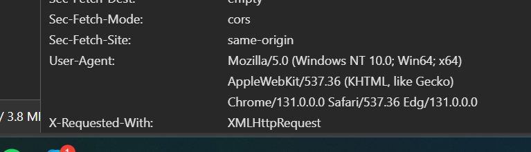

## Project Introduction

This project is about managing orders from other apps within the company's ecosystem.

## Architectural methodology and design pattern

### Feature-Sliced Design (FSD) architectural methodology

w
[Feature-Sliced Design (FSD)](https://feature-sliced.design/) is an architectural methodology aimed at organizing frontend projects in a way that enhances scalability, maintainability, and clarity. It focuses on dividing the application into distinct slices based on features, rather than technical layers (like components, services, etc.). This approach helps in managing complexity by ensuring that each feature is self-contained and can be developed, tested, and deployed independently

Reference:

- [Doc: Feature-Sliced Design (FSD)](https://feature-sliced.design/)
- [Feature-Sliced Design: The Best Frontend Architecture](https://dev.to/m_midas/feature-sliced-design-the-best-frontend-architecture-4noj)

Key Concepts of Feature-Sliced Design (FSD):

- Feature Orientation: The application is divided into features, each representing a specific piece of functionality or user interaction.
- Layered Structure: Within each feature, there are layers that separate different concerns, such as UI, business logic, and data handling.
- Isolation and Independence: Features are designed to be as independent as possible, reducing dependencies and making it easier to modify or replace them.
- Scalability: By organizing code around features, the architecture can scale more easily as new features are added.

#### Basic example

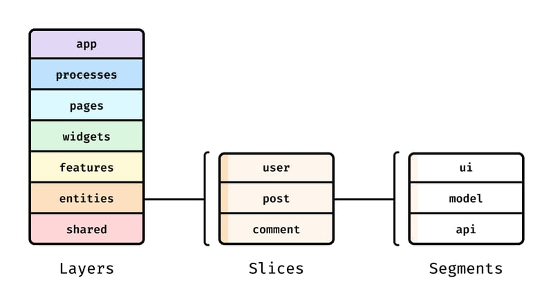

Here is a simple project that implements FSD:

- 📁 app
- 📁 pages
- 📁 widgets
- 📁 features
- 📁 entities
- 📁 shared

These top-level folders are called layers. Let's look deeper:

- 📁 app
  - 📁 routes
  - 📁 analytics
- 📂 pages
  - 📁 home
  - 📂 article-reader
    - 📁 ui
    - 📁 api
  - 📁 settings
- 📂 shared
  - 📁 ui
  - 📁 api

#### Layers

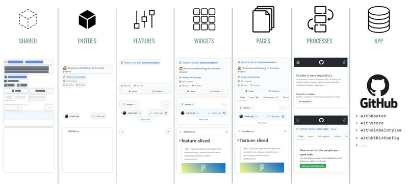

Layers are standardized across all FSD projects. You don't have to use all of the layers, but their names are important. There are currently seven of them (from top to bottom):

1. App\* — everything that makes the app run — routing, entrypoints, global styles, providers.
2. Pages — full pages or large parts of a page in nested routing.
3. Widgets — large self-contained chunks of functionality or UI, usually delivering an entire use case. These are standalone UI components used on pages
4. Features — this layer deals with user scenarios and functionality that carries business value. For example, likes, writing reviews, rating products, etc. It is an optional layer.
5. Entities — this layer represents business entities. These entities can include users, reviews, comments, etc. It is an optional layer.
6. Shared\* — reusable functionality, especially when it's detached from the specifics of the project/business, though not necessarily.

- these layers, App and Shared, unlike the other layers, don't have slices, and are made up of segments directly.

The trick with layers is that modules on one layer can only know about and import from modules from the layers strictly below.

One of the key features of Feature-Sliced Design is its hierarchical structure. In this structure, entities cannot use functionality from features because features are higher in the hierarchy. Similarly, features cannot use components from widgets or processes, as the layers above can only utilize the layers below. This is done to maintain a linear flow that is directed only in one direction.

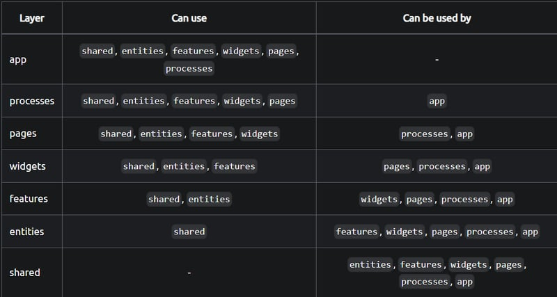

The lower a layer is positioned in the hierarchy, the riskier it is to make changes to it since it is likely to be used in more places in the code. For example, the UI-kit in the shared layer is used in the features, widgets, and even pages layers.

#### Slices

Next up are slices, which partition the code by business domain. You're free to choose any names for them, and create as many as you wish. Slices make your codebase easier to navigate by keeping logically related modules close together.

Slices cannot use other slices on the same layer, and that helps with high cohesion and low coupling.

#### Segments

Slices, as well as layers App and Shared, consist of segments, and segments group your code by its purpose. Segment names are not constrained by the standard, but there are several conventional names for the most common purposes:

- ui — everything related to UI display: UI components, date formatters, styles, etc.
- api — backend interactions: request functions, data types, mappers, etc.
- model — the data model: schemas, interfaces, stores, and business logic.
- lib — library code that other modules on this slice need.
- config — configuration files and feature flags.

Usually these segments are enough for most layers, you would only create your own segments in Shared or App, but this is not a rule.

### MVC design pattern

For basic usage, this project use the MVC design pattern to structure the code. but you should know that this is not a rule and you can use other design patterns like MVVM or other patterns.

Because we follow FSD architectural methodology, each feature be self-contained and not depend on other features, so inside each feature, we can use any design pattern that we want.

### Example

[Todo app](./src/example/README.md)

_...work in progress_

## Libraries

### Core

- Core: [VueJS](https://vuejs.org/)
- Typed routes: [unplugin-vue-router
  ](https://github.com/posva/unplugin-vue-router)
- Icons: [Unplugin Icons](https://github.com/antfu/unplugin-icons) + [Icones](https://icones.js.org/) + [Lucide](https://lucide.dev/)
- UI: [TailwindCSS](https://tailwindcss.com/) + [DaisyUI](https://daisyui.com/)
- State Management: [Pinia](https://pinia.vuejs.org/)
- Headless UI: [Ark UI](https://ark-ui.com/)
- I18n: [Paraglide JS](https://inlang.com/m/gerre34r/library-inlang-paraglideJs)

### System

- Lint: [ESLint](https://eslint.org/) + [Biome](https://biomejs.dev/) (for TypeScript)
- Format: [Prettier](https://prettier.io/) + [Biome](https://biomejs.dev/) (for TypeScript)
- E2E test: [Playwright](https://playwright.dev/)
- Unit test: [Vitest](https://vitest.dev/)
- Local CI/CD: [Husky](https://typicode.github.io/husky/)
- ...

## How to?

### Create testcase prompt

#### Create test for components

```
base on  @add-task.spec.ts  which used for test @add-task.vue , create test for @task-card-details.spec.ts  to test @task-card-details.vue , @task-card.spec.ts  to test @task-card.vue
```

#### Create test for ts files

```
base on @tasks.spec.ts  which used for test @tasks.ts , create test for @tasks.spec.ts to test @tasks.ts
```

### Commit

Because we follow Conventional Commits, so cli create commit is the best choice

```
npm run commit
```

### Local CI/CD

Every time you push to remote repository, it will run all the tests and lint to make sure the code quality is good.

```
.husky/pre-commit // CI/CD steps
```

### Unit test

```
npm run test.unit
```

### E2E test

this is not required, but if you want to run E2E test, you can use [Playwright](https://playwright.dev/)

```
npm run test.e2e
```

### Use Icon

Access this website [Lucide](https://icones.js.org/collection/lucide)

Click on "Unplugin Icon" button and paste to your script

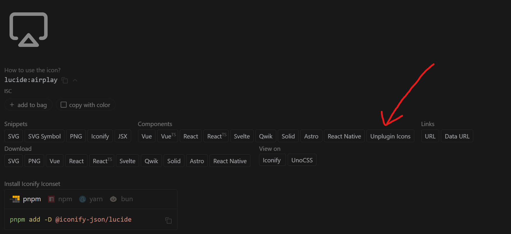

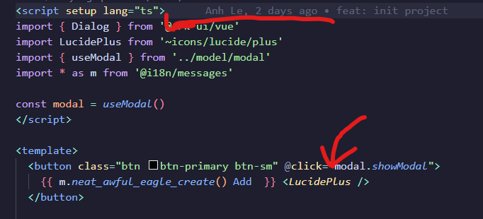

### Extract i18n from text

Select the text you want to convert to i18n. Press "Ctrl + >" or click on the yellow lightbulb icon next to it to display actions.

Click on "Sherlock: Extract Message" to extract that text into i18n

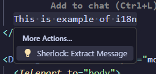

The system will automatically generate a name but we can still change it as desired

- **It's best to let the system generate the name automatically**
  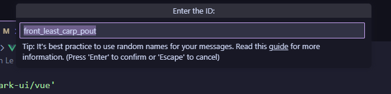

Result

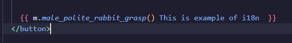

All vocabulary will be stored here

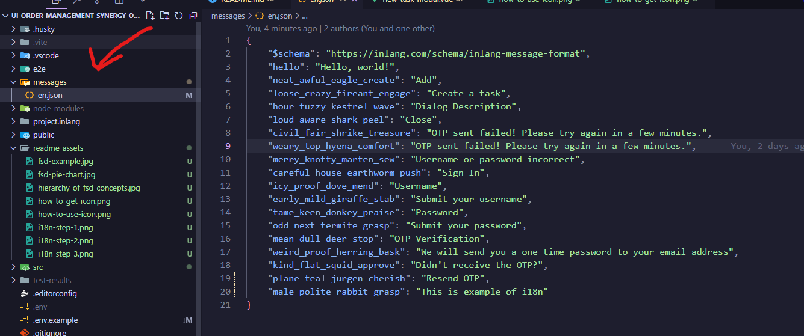

Later, if you need i18n for Vietnamese, just create an additional `vi.json` folder and use AI to generate translations from English to Vietnamese

Add Vietnamese to i18n configs

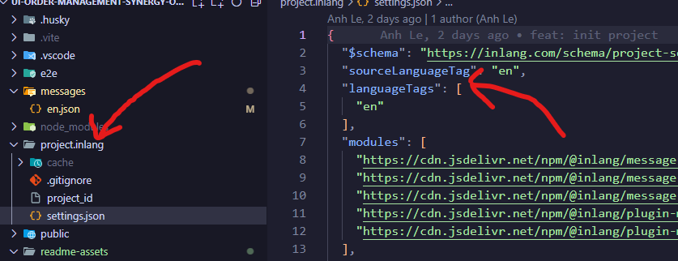

If you want to search for vocabulary or check how many characters are used in the file

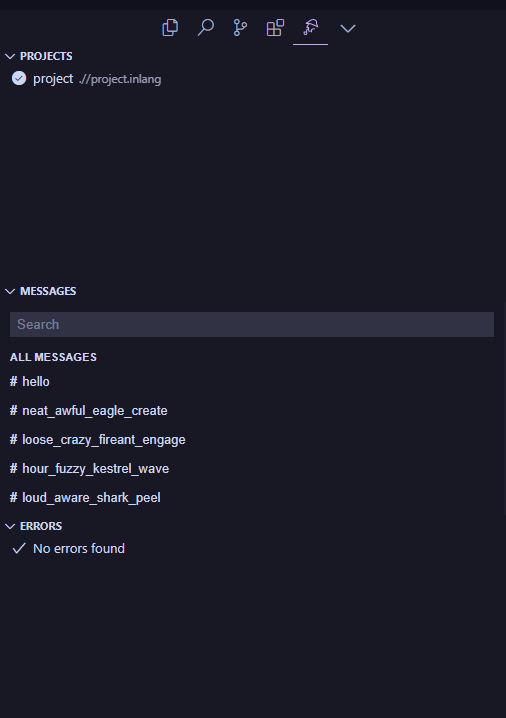

### Folder routes (Typed routes)

[File-based Routing](https://uvr.esm.is/guide/file-based-routing.html)

We will use the `pages` folder to store all page information and use the `routes` folder to divide routes for pages

```
const router = useRouter()

router.push({name: ''}) // will have type strict

<RouteLink :to="{name: ''}"> // will have type strict
```

**_...work in progress_**

## Auth flow

### Auth guard

[Source](./src/app/providers/router/index.ts)

If user tokens not exists and that route required auth -> we will clear cookie and state and then redirect user to sign in page

**We need to re-fetch user details every time user access to our website to update latest user status**

If user details exists and user in auth root -> redirect user back to main page

If user details exists and otp in local storage is not exists -> user not verify OTP -> redirect user to `verify-otp` page

### Sign in

[Source](./src/pages/sign-in)

When user sign in, system will do 3 step:

1. Verify user

- Call API to verify
  - If success: go to step 2
  - If fail: Log `username or password in correct`

2. Send OTP

- Call API to request send OTP user user email
  - If success: go to step 3
  - If fail: Log `You sign in to much. Please wait and try again`

3. Redirect to `Verify page`

### Verify OTP

User will need to get OTP from email that we sent OTP to submit to this page

When user submit OTP, system will do 3 step:

1. Verify OTP

- Call API to verify OTP
  - If success: navigate user to `home` page
  - If fail: clear OTP input
